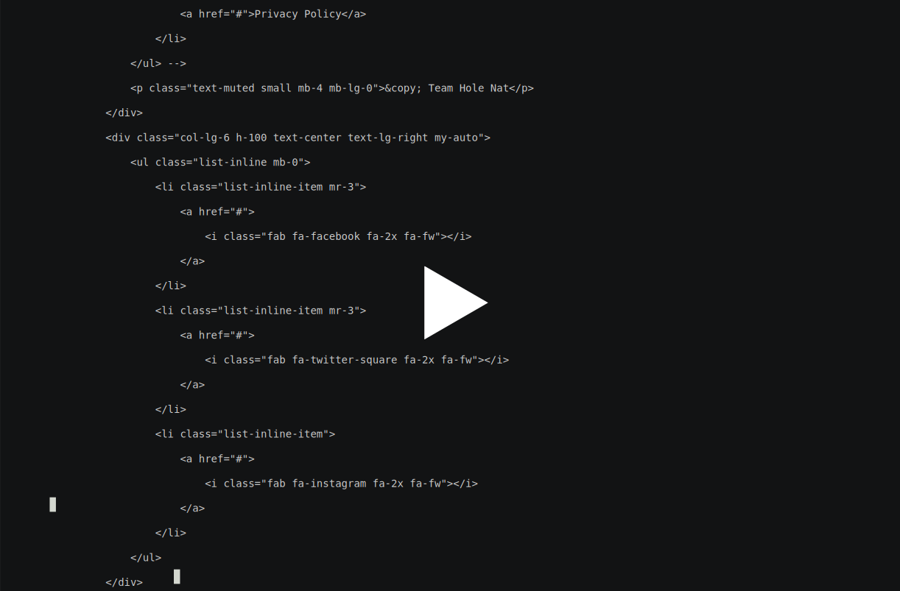

## How to use hole
This document is a guide for [hole](http://holenat.net) users to use hole export local servers

### Contents
- <a href="#quic">Quick start</a>
    - <a href="#quick-mac">Mac Os</a>
    - <a href="">Linux</a>
    - <a href="">Windows</a>

- <a href="#download">Download & Install</a>
- <a href="#configuration">Configuration</a>
- <a href="#export">Export local servers</a>
    - <a href="#http">Export local http server</a>
    - <a href="#https">Export local https server</a>
    - <a href="#grpc">Export local grpc serve</a>
    - <a href="#tcp">Export local tcp server</a>

- <a href="#about">About</a>

### <a id="quic" href="">Quick start</a>

**Use hole in two minutes

[](https://asciinema.org/a/303765)

Firstly, register in our [website](http://holenat.net/console). We provide a authtoken for users. If you have account, please [login](http://holenat.net/console)


<a href="" id="quick-mac">For mac os/linux</a>
Open teminal

- set hole file executable ```chmod +x hole```
- move binary file to $PATH ```mv hole /usr/local/bin```

```
➜  ~ hole --help ---------------------->> run with help options
./hole [OPTIONS]
Options:

  -auth string
    	authorize token
  -grpc int
    	local grpc server port
  -http int
    	local http server port
  -https int
    	local https server port
  -t string
    	target address (default "127.0.0.1")
  -tcp string
    	local tcp port list, seperate by,
  -v	print version

example:
   ./hole -http 8000
   ./hole -https 443
   ./hole -tcp 22,25
   ./hole -http 8000 -https 443 -tcp 22,25
   ./hole -https 443 -auth "YOUR AUTH TOKEN"

➜  ~ hole -http 8000 --------------------->> export 8000 with random user
Hole Nat By ICKelin
status    	 connected
AuthorizeToken
Username
Domain    	 gs429r35kzdh.v.holenat.net
Time left 	 0 days 0 hours 32 minutes
Lantancy  	 30ms

Forwarding table:
=============================================================
01. http://gs429r35kzdh.v.holenat.net => 127.0.0.1:8000

➜  ~ hole -https 9000 -auth yDJxBwNvQOeA4pvuK46SGQ==   ------------->> export 9000 with your token
Hole Nat By ICKelin
status    	 connected
AuthorizeToken	 yDJxBwNvQOeA4pvuK46SGQ==
Username  	 yingjiu
Domain    	 yingjiu.v.holenat.net
Time left 	 2 days 16 hours 7 minutes
Lantancy  	 27ms

Forwarding table:
=============================================================
01. https://yingjiu.v.holenat.net => 127.0.0.1:9000

```


### <a id="download" href="">Download & Install</a>
[Download](http://holenat.net) binary file, we support the following platform

| OS | ARCH | desc |
|---|---|---|
| mac os | amd64 | for mac |
| linux | amd64 | for linux(ubuntu,centos) |
| linux | arm | for respi i386 |
| linux | arm64 | for respi x86_64 |
| windows | x86_64 | for windows x86_64 |

run:
```chmod +x hole```
```mv hole /usr/local/bin```

### <a href="" id="configuration">Configuration</a>
Before running, we suggest to configure you authtoken first, the authtoken is your unique id. 

the hole will save your authtoken in hole.conf and will load from hole.conf next time.

**For command line**
```hole -auth $YOUR_AUTH_TOKEN```

for windows user, if you are not good at command line. **double click hole.exe** and fill the authtoken.

```

➜  ~ hole

Welcome for Hole nat service

-----------------------------------------------------
	1、Config AuthToken(OPTION)
	2、Config Local HTTP server port(OPTION)
	3、Config Local HTTP server port(OPTION)
	4、Config Local TCP server ports(OPTION)
-----------------------------------------------------

1、input Authorize Token(REQUIRED):yDJxBwNvQOeA4pvuK46SGQ==
2、input local http port(OPTION):
3、input local https port(OPTION)
4、input local tcp ports(OPTION):

```

close the window after config.

## <a href="" id="export">export local servers</a>
currently, we support http, https, grpc, tcp protocol for you. http and https use 80,443 port for all users. for grpc, we provide a static port 880.

### <a href="" id="http">Export local HTTP server</a>

You should run you http server first and listen 9000. we use ```python -m SimpleHTTPServer 9000```

for a test http server, for python3, you may run ```python -m http.server 9000``` instead

then run command ```hole -http 9000```

```

➜  ~ hole -http 9000
Hole Nat By ICKelin
status    	 connected
AuthorizeToken	 yDJxBwNvQOeA4pvuK46SGQ==
Username  	 yingjiu
Domain    	 yingjiu.v.holenat.net
Time left 	 2 days 16 hours 7 minutes
Lantancy  	 27ms

Forwarding table:
=============================================================
01. http://yingjiu.v.holenat.net => 127.0.0.1:9000

```

Open  http://yingjiu.v.holenat.net  in your browser. 
success !!!

### <a href="" id="#https">Export local HTTPS server</a>

You should run you https server first and listen 9000. we use **nginx**

for a test https server

then run command ```hole -https 9000```

```

➜  ~ hole -https 9000
Hole Nat By ICKelin
status    	 connected
AuthorizeToken	 yDJxBwNvQOeA4pvuK46SGQ==
Username  	 yingjiu
Domain    	 yingjiu.v.holenat.net
Time left 	 2 days 16 hours 7 minutes
Lantancy  	 27ms

Forwarding table:
=============================================================
01. https://yingjiu.v.holenat.net => 127.0.0.1:9000

```

Open  https://yingjiu.v.holenat.net  in your browser. 
success !!!


### <a href="" id="#grpc">Export local GRPC server</a>
For new version of hole, we support grpc, grpc is as easy as http,https, but we provide another port 880 for it.

```
➜  ~ hole -http 80 -grpc 9091
Hole Nat By ICKelin
status    	 connected
AuthorizeToken	 yDJxBwNvQOeA4pvuK46SGQ==
Username  	 yingjiu
Domain    	 yingjiu.v.holenat.net
Time left 	 9 days 23 hours 56 minutes
Lantancy  	 14ms

Forwarding table:
=============================================================
01. grpc://yingjiu.v.holenat.net => 127.0.0.1:9091
02. http://yingjiu.v.holenat.net => 127.0.0.1:80

```


### <a href="" id="#grpc">Export local TCP servers</a>
If http, https and grpc are not enough for you, for example, ssh, windows remote desktop you want, tha you need to use tcp ports.

we provide a public ip and random tcp port for you, we support at most 10 tcp ports for each user.

If you want to use tcp, the tcp options is required.

```
➜  ~ hole -http 80 -grpc 9091 -tcp 22,3389
Hole Nat By ICKelin
status    	 connected
AuthorizeToken	 yDJxBwNvQOeA4pvuK46SGQ==
Username  	 yingjiu
Domain    	 yingjiu.v.holenat.net
Time left 	 9 days 23 hours 52 minutes
Lantancy  	 14ms

Forwarding table:
=============================================================
01. grpc://yingjiu.v.holenat.net => 127.0.0.1:9091
02. http://yingjiu.v.holenat.net => 127.0.0.1:80
03. tcp://yingjiu.v.holenat.net:10000 => 127.0.0.1:22
04. tcp://yingjiu.v.holenat.net:10001 => 127.0.0.1:3389

```

### <a href="" id="about">About</a>
hole nat team provide nat traversal, vpn and sdwan service, our goal is to save developer and employee's time. 