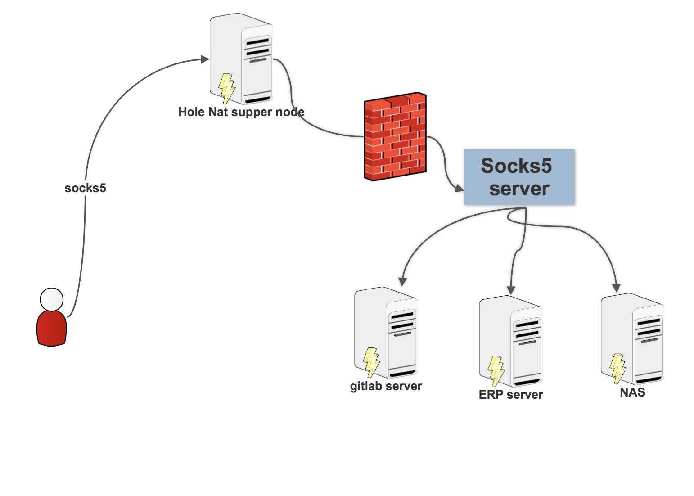

## Using hole to visit websites in your office
The COVID-19 makes some employees in china work at home, what if they want to use gitlab, ERP or anyother website in there office LAN. some big companies use VPN, but its too expensive for startups. 

The hole provide a solution that may help, use our NAT traversal services to export your local [socks server](https://github.com/holenat/holesocks), anyone else configure socks proxy with authization could access to your office system.



### Step by step

**step1:** download [holesocks5](https://github.com/holenat/holesocks/releases) and run ```holesocks5 -c config.toml``` in a server at your office lan, make sure that this server have access to your gitlab/erp system.

**step2:** Download [hole](http://holenat.net) and run ```hole -tcp 3099``` the default port for holesocks5 is 3099, if you have changed it, the hole command should be ```hole -tcp $HOLE_SOCKS%_PORT```

**step3:** Configure socks5 proxy in your personal computer, then you could access to your erp/gitlab inf browser.

### Attention

We suggest that you MUST configure the socks5 username and password, otherwise, anyone try to connect to the port with socks5 protocol may access to your systems.